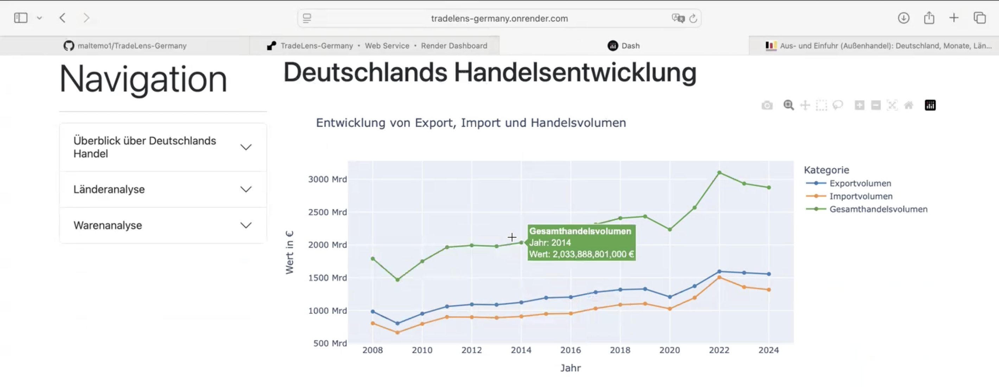
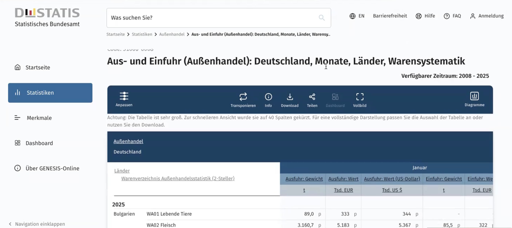

# TradeLens Germany

An interactive web application for analysing Germany's international trade flows using official DESTATIS data:



This project was developed during my internship/consultancy at the German-Iranian Chamber of Commerce (AHK Iran) in Tehran. The dashboard enables users to explore Germany's imports and exports through interactive visualisations across countries, product groups and time periods.

---

## Project Overview

TradeLens Germany was developed to simplify the analysis of German foreign trade statistics for internal market analyses and business intelligence purposes.

Instead of manually analysing large Excel files, users can interactively explore the data through an intuitive web interface.

The application provides dynamic visualisations, country comparisons, product analyses and trade balance calculations.

---

## Features

The dashboard includes numerous interactive analyses, including:

- Annual exports and imports by country
- Annual exports and imports by product group
- Monthly trade development
- Country comparisons
- Product comparisons
- Top trading partners
- Trade balance calculations
- Interactive filtering using dropdown menus
- Dynamic Plotly visualisations
- Automatic scaling of chart axes
- Hover information for detailed values

---

## Technologies

The project was built using:

- Python
- Dash
- Plotly
- Pandas
- NumPy
- HTML Components (Dash)
- GitHub
- Render

---

## Data Source

Official German foreign trade statistics provided by

**DESTATIS – Federal Statistical Office of Germany**



The data were cleaned, transformed and prepared in Python before being integrated into the dashboard.

---

## Skills Demonstrated

This project demonstrates practical experience in:

- Data Analysis
- Data Cleaning
- Data Preparation
- Data Transformation
- Data Visualisation
- Interactive Dashboard Development
- Python Programming
- Business Intelligence
- Web Application Development
- Version Control using GitHub
- Cloud Deployment using Render
- Software Debugging

---

## Project Structure

```
TradeLens-Germany/
│
├── data/
│   ├── aggregated_df.csv
│   ├── trade_spec_country_and_year.csv
│   └── ...
│
├── graphs/
│   ├── overview_trade_*.py
│   ├── trade_spec_*.py
│   └── ...
│
├── TradeLens-Germany.py
├── requirements.txt
└── README.md
```

The application is organised into modular Python files.

Each dashboard page is implemented as an individual module containing its own layout and callbacks.

---

## Dashboard Demonstration

The deployed dashboard is currently offline because the cloud hosting service (Render) was discontinued after completion of the project.

A complete walkthrough of the dashboard is available here:

**Dashboard Tutorial**

*(Insert YouTube link here)*

The video demonstrates

- dashboard navigation
- interactive filtering
- available analyses
- visualisations
- functionality of the application

---

## About the Project

This project was developed independently as part of my work at the German-Iranian Chamber of Commerce (AHK Iran).

The objective was to provide an interactive analytical tool for exploring German foreign trade data and supporting market analyses.
